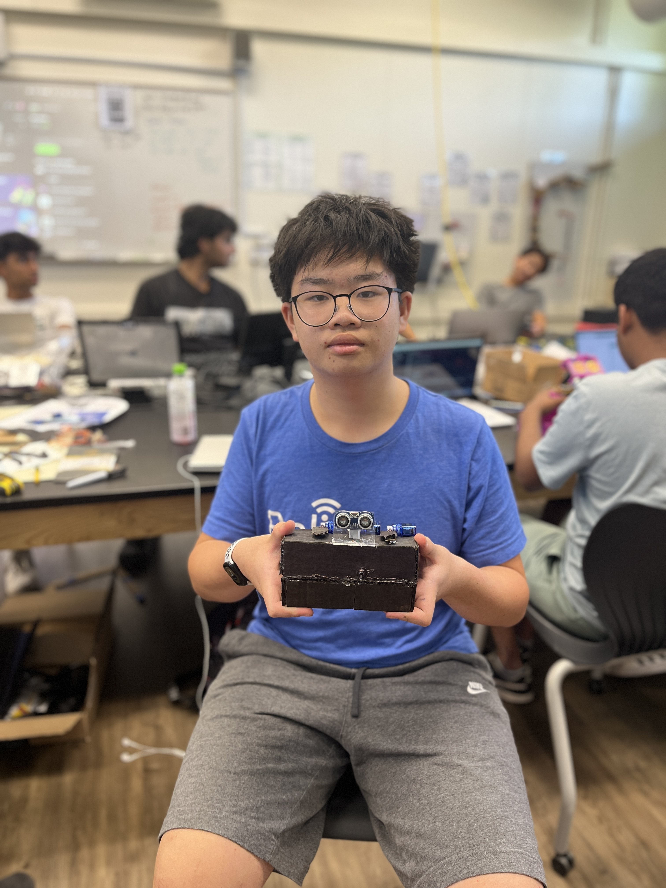
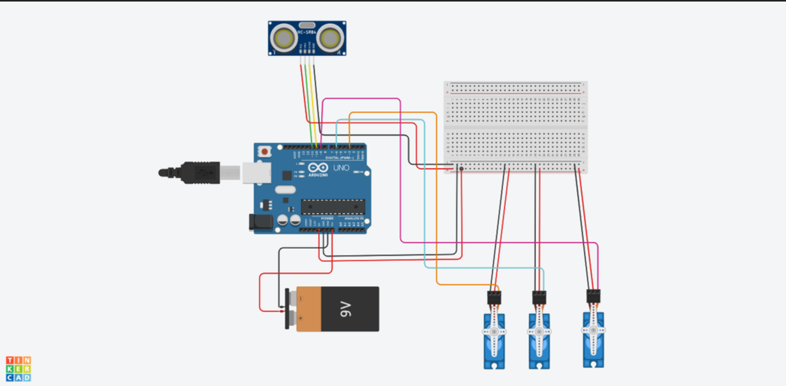

# Rock Paper Scissor Machine

My Rock Paper Scissors machine (RPS Machine) functions as a tool that can be used for both entertainment and decision making. It is powered by a 9-volt battery, but can be powered by a computer or other alternate power source. The battery powers an Arduino uno, which is linked to 3 servos and an ultrasonic sensor using different jumping wires. When the ultrasonic sensor detects a change in distance using the frequent sound waves, it will notify the Arduino about it. The C++ code that the arduino UNO was given tells it to send a signal to a random servo, which will hold up a rock, paper or scissors sign. One of the many challenges I faced was figuering out a way to interpret the switch into the wire connecting battery and the Arduino.

| **Engineer** | **School** | **Area of Interest** | **Grade** |
|:--:|:--:|:--:|:--:|
| Evan L | Greene Middle School | Electrical Engineering | Rising 8th Grader


  
# Final Milestone

<iframe width="560" height="315" src="https://www.youtube.com/embed/F7M7imOVGug" title="YouTube video player" frameborder="0" allow="accelerometer; autoplay; clipboard-write; encrypted-media; gyroscope; picture-in-picture; web-share" allowfullscreen></iframe>

I have added a stand that makes the project look somewhat better and helps make the chosen symbol easier to see, and have added two latches that keep the bottom of the project closed. I also planned to add a small compartment in the bottom to store small things, but unfortunatley I ran out of time.
One of the biggest challenges I have faced is making sure that I did not short the circuit. In fact, I have come close to frying my Arduino 3 times over the course of 3 weeks! As it turns out, I am prone to mixing up my ground and power wires, both on my servo and on the connections between the breadboard and the arduino. When these wires are mixed, the ground wire that should be providing a safe path for power to run in the case of a short circuit is recieving power, and as a result, creates a short circuit, damaging various components in the process.

# Second Milestone

<iframe width="560" height="315" src="https://www.youtube.com/embed/OKKf9Bwz9w0?si=joaem4pDMoSS2EcE" title="YouTube video player" frameborder="0" allow="accelerometer; autoplay; clipboard-write; encrypted-media; gyroscope; picture-in-picture; web-share" referrerpolicy="strict-origin-when-cross-origin" allowfullscreen></iframe>

For my second milestone, I secured the entire circuit to the cardboard base and added the rock, paper and scissors symbols to the servos. one of the greatest challenges I faced was getting the battery to stay in place. While this may not seem difficult, at one point while I was hot glueing the cardboard gaurds for the battery onto the base, I notice there was smoke, and when I looked into the frame I saw that the battery was emmiting smoke and the power wire was melting. I still am not sure what caused this, although it may be due to me leaving the circuit on or somehow short circuiting it. This, along with many other close calls, such as a faulty battery, makes it a miracle that my arduino hasn't been burnt to a crisp yet. Eventualy, I got the circuit right and it hasn't shorted again. next I have to add an LED the indicate that the arduino is on and add an openable base. 

# First Milestone

<iframe width="560" height="315" src="https://www.youtube.com/embed/wZV70MqZfsc?si=4fA33KtGGKvFgOIG" title="YouTube video player" frameborder="0" allow="accelerometer; autoplay; clipboard-write; encrypted-media; gyroscope; picture-in-picture; web-share" referrerpolicy="strict-origin-when-cross-origin" allowfullscreen></iframe>

This machine uses an ultrasonic sensor, which, when it detects a change in distance from a solid object through frequently emmited sound waves, moves random servo. The movement of the servo is randomized through the 'random' function in the C++ arduino code. When The ultrasonic sensor detects movement, it tells the Arduino Uno, which sends a signal to a random servo, telling it to move. Everything is linked together by a medium sized breadboard, and is powered by either a 9-volt battery or an alternate electrical device.
I planned to make and test the code, plan out the circuit and check that the servos and ultrasonic sensor work. I faced a few challenges during this milestone one of which was making sure each of the servo wires are wired to the right ports, such as ground and power. 


# Schematics 



# Code

```c++
#include <Servo.h>

volatile long A;

float checkdistance_11_10() {
  digitalWrite(11, LOW);
  delayMicroseconds(2);
  digitalWrite(11, HIGH);
  delayMicroseconds(10);
  digitalWrite(11, LOW);
  float distance = pulseIn(10, HIGH) / 58.00;
  delay(10);
  return distance;
}

Servo servo_3;
Servo servo_6;
Servo servo_9;

void setup() {
  A = 0;
  pinMode(11, OUTPUT); 
  pinMode(10, INPUT);
  pinMode(12, OUTPUT);
  servo_3.attach(3); 
  servo_6.attach(6);
  servo_9.attach(9);
}

void loop() {
  if (checkdistance_11_10() < 20) {
    A = random(0, 4);
    switch (A) {
      case 1:
        tone(12,131);
        delay(100);
        noTone(12);
        servo_3.write(179);
        delay(1000);
        servo_3.write(90);
        delay(500);
        break;
      
      case 2:
        tone(12,131);
        delay(100);
        noTone(12);
        servo_6.write(179);
        delay(1000);
        servo_6.write(90);
        delay(500);
        break;

      case 3:
        tone(12,131);
        delay(100);
        noTone(12);
        servo_9.write(179);
        delay(1000);
        servo_9.write(90);
        delay(500);
        break;
    }
  }
}
```

# Bill of Materials

| **Part** | **Note** | **Price** | **Link** |
|:--:|:--:|:--:|:--:|
| 9-Volt Battery | Used to power the robot | $12.34 | <a href="https://www.amazon.com/Amazon-Basics-Performance-All-Purpose-Batteries/dp/B00MH4QM1S/ref=sr_1_5?crid=NOBNDBCXAMU2&dib=eyJ2IjoiMSJ9.LzVLI_Okv1aX44UDnl3M2wmckTFUx_wn4DFEVq1jt6YlixM49-Dq2GivmKD_qLib9CXcIW8ZbAyF_hrSEzKI11Dewzg2dBcKsvd3v1FEvGsnQQRifFhgNbhSkB-q035E2sn_rHokjzjgBh9uN6IFKief9LQoKJjTly7S-6DizcEhAajswmczqBVrpEH8ogEHQOFiv6gg2Y44kseWjwq1aQtmE5dDL1QiTou5vAhyYQK1a3Apcdjc4T9ZzwH3wFGzQLHSTX5Pdi7WWNCS133KsR4lIFUm3IQ8JNz9Evf8J9E.SgVONeBUYxL2w2A971f9WoIg5dZbGA29eLaM5aBZAzU&dib_tag=se&keywords=9%2Bvolt%2Bbattery&qid=1719523467&rdc=1&sprefix=9%2Bvolt%2Bbattery%2Caps%2C147&sr=8-5&th=1"> Link </a> |
| Arduino UNO | To tell each of the components what to do | $27.60 | <a href="https://www.amazon.com/Arduino-A000066-ARDUINO-UNO-R3/dp/B008GRTSV6/ref=sr_1_3?crid=203UWEZ3B3BUO&dib=eyJ2IjoiMSJ9.MazmhFfn-DF8W5oyX_S-tH7qkt_WuogERq_8M3-FTf4cBKFAsIU8VtLC0BDz9LupUEYEpssCNi_aEZFE6m5PPnUnxUD055IxzG01a92Ufee_LDc0Z2yF_nGagiyJbh7uoYixAdJxeBkFFWo45pZIi5GnTGU1umpzMlSCh4QZ8KuKyZj7VIjyXwB2vU8mkC7kZ1ltD2lH9quj8udS9MUeqTVeUTBmIuePFyLd0VF29WM.5WOy3pXx9LSbiwdPAa8ROu9S-HeRp1p4MJsZEnH3YK0&dib_tag=se&keywords=arduino+uno&qid=1719608387&sprefix=arduino+uno%2Caps%2C166&sr=8-3"> Link </a> |
| Jumper Wires | Used for connections | $6.98 | <a href="https://www.amazon.com/EDGELEC-Breadboard-Optional-Assorted-Multicolored/dp/B07GD2BWPY/ref=sr_1_1_sspa?crid=2GIASGVTZN7D0&dib=eyJ2IjoiMSJ9.tjHxIQLJsk16_0YVtUGN6Tqnr8euWNsWVjpSaq5RQkbG3UN9TjR0k0Z9kHv-_Tv_JZXRNnMnZIBITD5leVDejk2lOQI1xlNPEgfGyJj6fa7E3hz-A6yYbp4zGTqBx7sKNLN2Iqm1zxeXA41HGyiaurKqyxJGMbHVr3lVhxvS8kwa_GIge__MNxoqstjjN7rW8Z1LFvQjO36-H2Qw4WfmG-4n05mOM8iMop37UVCgXPObbzbK1Ejou3NTFd0ClHKI0kve9-oO3-J3bX7oeHa3DVNoU3to9u4bJ5V-ps6pySU.xrRnInWm7p-kSWjvvbW-grXhz-X7WbP32hcGaRhruMI&dib_tag=se&keywords=jumper%2Bwires&qid=1719523989&s=electronics&sprefix=jumper%2Bwires%2Celectronics%2C156&sr=1-1-spons&sp_csd=d2lkZ2V0TmFtZT1zcF9hdGY&th=1"> Link </a> |
| Cardboard | Used for the frame | $0.00 | Recycled |
| Ultrasonic Sensor | To trigger the Arduino | $6.99 | <a href="https://www.amazon.com/WWZMDiB-HC-SR04-Ultrasonic-Distance-Measuring/dp/B0B1MJJLJP/ref=sr_1_4?crid=179LZ0OU0QKFP&dib=eyJ2IjoiMSJ9.eqTALHM8pOp6RiYX3iy9K-W7dgivmhsxyWJ1LYCoHT8WHad-jx1NdR8mhhnCVzO30vdCg3uHwO7MoDWxec_JGtJBqsxiaOo4-TGEICUbt4s7nTFRmHNkDKFu6Xn3j7CeRnYYcXOtf67SYSUHsANQDlT4aTQc-4UbLsQq3FgkblPH4zVpe8f-wrO4RDSHFgrL4hSaYCHkXXtMrMMaDAtMqshKsi_ETi00dJ8GZ1IpbXc.ZLGzMBBx5rt95FRpHR9QjXASgV2Bpq_11ECrxB8PA20&dib_tag=se&keywords=ultrasonic%2Bsensor&qid=1719524231&sprefix=ultrasonic%2Bsenso%2Caps%2C157&sr=8-4&th=1"> Link </a> |
| Black paint | To paint the frame | $12.99 | <a href="https://www.amazon.com/Jacquard-Products-Black-Textile-Color/dp/B08KGYMLD9/ref=sr_1_1_sspa?crid=36QZDUR4NZ3YI&dib=eyJ2IjoiMSJ9.GHVXFW1bR2z72QfsIlGz6I1Klio7j0pt69gsXJsKA1U-LM3sEGRt9qHcqq-TuZ0U1RgLxj7h9sVEa5UGPahwCCTuRnFK89eAJmr1A10B8_7cMsftLjJbKgCYZ6eSqdyx-yh9sBbune6dNEfKy_EuvjWcrbJUz_Bjwdp0oyJFhWGLYweqAOlRNIZwykzsrnU63PnwmkqxTz5JDNsI2e89_TSMNBuuzpl9KnIXdhgPSYOrfzAADXud3bvbiQdiqjADtWcq_3yqprtbccV97wW5w_uDNGTuJQGRoI7clmwiaE.AIQRms05ylST_6sMMIzGSJJ_IgYtS_Nx93JU3YJHnXs&dib_tag=se&keywords=black%2Bfabric%2Bpaint&qid=1719524354&sprefix=blakc%2Bfabric%2Bpaint%2Caps%2C163&sr=8-1-spons&sp_csd=d2lkZ2V0TmFtZT1zcF9hdGY&th=1"> Link </a> |
| Battery holder | Holds the battery in place | $5.99 | <a href="https://www.amazon.com/LAMPVPATH-Pack-Battery-Holder-Switch/dp/B07T83B4SW/ref=sr_1_1_sspa?crid=1H832FR62E4DM&dib=eyJ2IjoiMSJ9.Z8nYMSb9jUOuf-Gh6E8ddJOKkM2PB-gL8z3Ewv9whDpvZ1UblMzUTjrsrkm_JXLxmEYBAX_PTe9pxnxDwmO9Szh2Bos1L19eTXfc8kJRtt9O0aR4Xd-9L5waPHqbsnc3-9Z-hxQ_q05xUcrwHliITeVKKN1pWqIbCzsJHjEVmxTExTbxOILKV36zki_lk1VG9tsR0IRtgOqoH-XmT-kv-ULavTw3SFGJ8ilo19frwxU.LpTl0Aneap121sYjZtGyzQ7fvpytwyr1Vac1fGAtLLs&dib_tag=se&keywords=9-volt+battery+holder&qid=1719524410&sprefix=9-volt+battery+holder%2Caps%2C153&sr=8-1-spons&sp_csd=d2lkZ2V0TmFtZT1zcF9hdGY&psc=1"> Link </a> |
| Breadboard | Securing connections across the project | $8.99 | <a href="https://www.amazon.com/Breadborad-Solderless-Breadboards-Distribution-Connecting/dp/B082VYXDF1/ref=sr_1_1_sspa?crid=2FVDMY6FM3X80&dib=eyJ2IjoiMSJ9.kysEkFuknSsx6HNYYlrkwUZtHhv3K64sZBtoqKn0u4AH9LOCMnMEvGdt3iuLOL8jabmrKCsgCEgBEH5qMDJC92v2vgEC80RPvXd2x2Jh6KEGw56LIs0Zgje2VzdHy_JLSLexUls18aTTdz2fiFWrR-i4HXkiH2cfZ8Mzl56_CuDPkYVYDIx4_1SdRSTMJYopt3JuxZr32KVJtw7UtitPwELvS0NzNJ1CIOdSHqt_ZiA.yT8M74cA3899JZNtqMtsZIacq1Awwr2qNdfv6WftysY&dib_tag=se&keywords=small+breadboard&qid=1719524512&sprefix=small+breadboard%2Caps%2C136&sr=8-1-spons&sp_csd=d2lkZ2V0TmFtZT1zcF9hdGY&psc=1"> Link </a> |
| 3x Servos | Used to hold up a random sign | $7.99 | <a href="https://www.amazon.com/Micro-Servos-Helicopter-Airplane-Controls/dp/B07MLR1498/ref=sr_1_6?crid=2VFSVBB2X0QGU&dib=eyJ2IjoiMSJ9.POZxW8ictf28-1c0EFTfUoDsLKI-3mUuGW157z8b8DtPVCCMSg2a_gaKdkbOb8vnnLHAUu2vqFIg0iFzvDpnh5J5rSKbVx_rJRjhvOx2GgwlocMAV40N-nb87xxZK49qn3eauOa8VpBYiueCJHfv1j0r43CIjky1ADEBKI2_p8fz_PUTHptpgMgSEeVssWqPRgn3HFBWN5Q4nTMhOvk8VdhqCCEpxFtRxVQ4rzd3BZnD9QTMGJU55UQtpUJVANSlCIEzBtp_wGbYkVzzoZBhEkybhIE0As38vo_wmBdX3hc.t3e69fPflz8wN_OSKpy9r6UVqfJnxA9o_FtkHsqDObA&dib_tag=se&keywords=9-gram%2Bservo&qid=1719524545&sprefix=9-gram%2Bservo%2Caps%2C139&sr=8-6&th=1"> Link </a> |
| Hot Glue | to hold the project together | $9.99 | <a href ="https://www.amazon.com/Krightlink-Sticks-School-Crafts-Repairs/dp/B0BC878ZRG/ref=sr_1_1_sspa?crid=3VTB5DWPSM064&dib=eyJ2IjoiMSJ9.Dg7hXYioE1SMY0Xf_SOMUA1tTOYPNLLUXT12T2VAvDxZFN6sRLkJjZGvPfYFQeOuOEwMHwb3IAbxgilYo5HE-WA13aThkplhctepZBa9nHoZpSm3FoLHs4MXEJaE3FROqXJiYaHFoTYPTEi3Iez70Wl-z9NXQmBr9GEfx2A5hdJbrwpswIoA7Hu0C95tTHuH6i2gA4ab-k1UIKgRFNPlhGbvKx2rlNVe_6ZQUydEKmgDskr7yD2fCRxo479iG7owkUePRBI07kxjz56p4Dki9vgOzegVIs6BuEsiNNiJVk4.uqhalhB_pz7L0Nehvb2MJiRgdlaAIsrRJlrjF95qQIM&dib_tag=se&keywords=hot%2Bglue%2Bgun&qid=1719524596&sprefix=hot%2Bglue%2Bgun%2Caps%2C141&sr=8-1-spons&sp_csd=d2lkZ2V0TmFtZT1zcF9hdGY&th=1"> Link </a> |
| Small Switch | To turn the project on and off | $0.88 | <a href="https://www.amazon.com/DaierTek-250VAC-Rocker-KCD1-101-Plastic/dp/B07S2QJKTX/ref=sr_1_1_sspa?crid=KQ8NAFOO93S8&dib=eyJ2IjoiMSJ9.-qUE2IQIdh_CASb-3tn1CTBCcEYw9KMP9MBGxwSEkjoe5IBK-JJX6QinQcFWV5BQ_QRDtZ_XmdWZqTOuLsOfR-STJyLQDHGKCAtzEUsm_cbTOf_9QwRQs8ZL0s35gJg-s4GHeu_2rxQYCXhtWMo6ih0INlbZz8YTZAUR9BOAzfaBRm9MoZoxcI8t_Y-iDyJmNVzm-L7bKDN4mxboRcrnOtWyXLpbBv3UlXlnWXDTggU.tRpHTgFuzxqPUb7Yalmd_z2omGQOphuhFlIwq9EJl1o&dib_tag=se&keywords=small+switch&qid=1719608433&sprefix=%2Caps%2C206&sr=8-1-spons&sp_csd=d2lkZ2V0TmFtZT1zcF9hdGY&psc=1"> Link </a> |

# Other Resources/Examples
- [Instructables Instructions by CrazyScience](https://www.instructables.com/Rock-Paper-Scissors-Using-Tinkercad-Circuits-and-A/)
  
# Starter Project: RGB Slider

<iframe width="560" height="315" src="https://www.youtube.com/embed/juAjxWSKfpk?si=qo6yIqo7F9ixu_79" title="YouTube video player" frameborder="0" allow="accelerometer; autoplay; clipboard-write; encrypted-media; gyroscope; picture-in-picture; web-share" referrerpolicy="strict-origin-when-cross-origin" allowfullscreen></iframe>

This project used a circuit board with 3 potentiometer sliders and an LED attached to it. The potentiometer sliders control the amount of red, green and blue light going into the LED.
Once I soldered the components in place, I needed an alternate power source such as a laptop or wall socket, as the device can't power itself.
